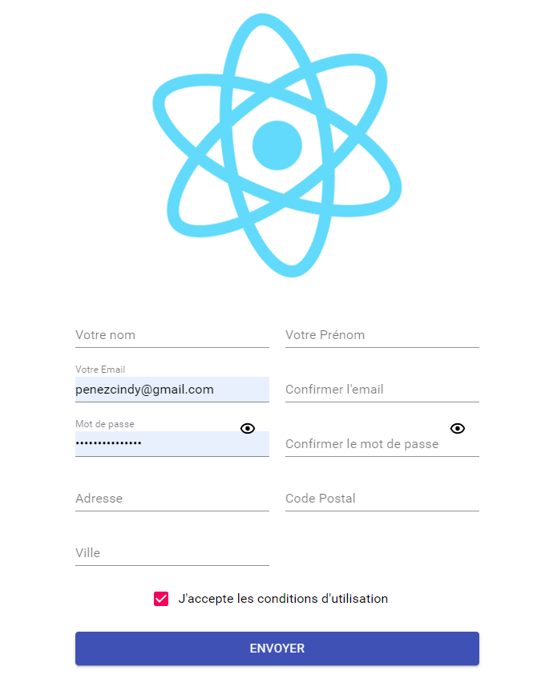
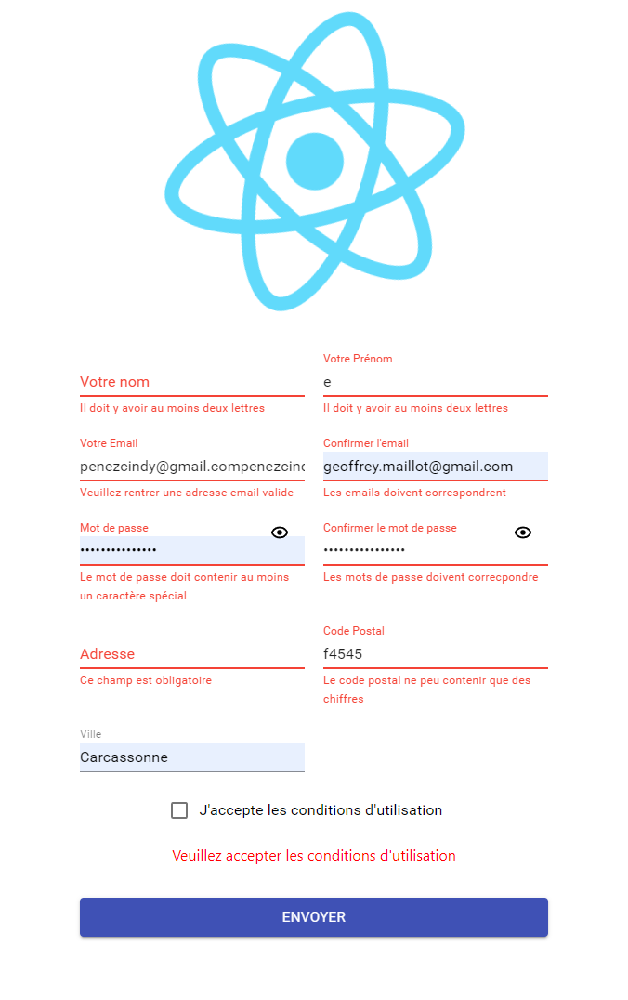

# React-hook-form_Yup


## 📖 Lesson learned

- react-hook-form
- yup 

## 🛠 Stack

- React
- Gestion Formulaire
   - react-hook-form
   - yup
   - yup-password


## Screenshots





## Run Locally


Clone project
```bash
git clone git@github.com:Projet
```

Go to folder directory
```bash
cd Projet
```


Install dependencies
```bash
# yarn
yarn

# npm
npm install
```

Start server
```bash
# yarn
yarn start

# npm
npm start

# Projet run on http://localhost:3000/
```


## prerequisites

- Node.js

## 🔗 Links

[](https://maillot-geoffrey-portfolio.xyz/)
[](https://www.linkedin.com/in/geoffrey-maillot-06a1411bb/)
[](https://github.com/Geoffrey-Maillot/)
